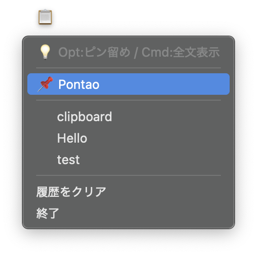

# Simple Clipboard Manager for macOS





macOSのメニューバー常駐型のシンプルなクリップボード履歴ツールです。
**推奨：配布アプリ（zip）は Releases からダウンロードしてください。**

## ダウンロード（推奨）

最新版はこちら：
[https://github.com/pontaponta5362/simple-clipboard-manager-mac/releases/latest](https://github.com/pontaponta5362/simple-clipboard-manager-mac/releases/tag/v1.0.0)

## できること

* クリップボード履歴を最大 10 件保持
* 履歴をクリックすると、その内容をクリップボードに戻します
* 修飾キーで便利操作：

  * **⌥ Option**：ピン留め／解除（履歴の先頭に固定）
  * **⌘ Command**：全文表示（ポップアップ）

## インストール / 使い方（アプリ版）

1. Releases から **zip** をダウンロード
2. zipを解凍して **`.app`** を取り出す
3. **Applications（アプリケーション）** に移動して起動

### 初回起動で開けない場合（Gatekeeper）

未署名アプリのため、初回起動時に警告が出ることがあります。

* Finderでアプリを **右クリック → 開く** を試してください

### “xattr” が必要になる場合

ダウンロード方法や環境によっては、アプリに隔離属性（quarantine）が付いて起動できないことがあります。
その場合は以下を実行してください（パスはあなたのアプリ名に合わせて変更）：

```bash
xattr -dr com.apple.quarantine /Applications/clipboard_manager.app
```

## データ保存先

クリップボード履歴はローカルに保存されます：

* `~/.clipboard_history_data.json`

## ソースから実行したい人向け

Pythonから直接実行する場合：

```bash
pip install -r requirements.txt
python clipboard_manager.py
```

## ライセンス

MIT License

## チェックサム（SHA-256）
clipboard_manager.zip: 9e7afa15152a44ead9b507801d8fa6b6256f92e1d4491b1873c8d187f61d6228

